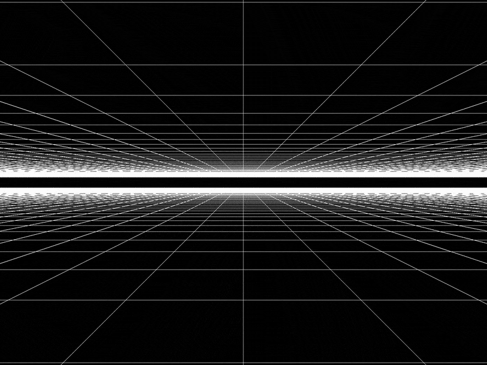

# Procedural Grid Mesh for Unity 3D
Create a mesh based grid for your cool Unity 3D project.

<!--  -->


## Three simple steps
1. [Download `GridMesh.cs`](https://raw.githubusercontent.com/Volorf/Hover3D.js/master/hover3D.js);
2. Add `GridMesh` component to a game object;
3. Set it up.

## How to set it up via Inspector

* **`X Segments`** defines how many cell you will get on the X axis.
* **`Y Segments`** defines how many cell you will get on the Y axis.
* **`X Step`** defines a cell width.
* **`Y Step`** defines a cell height.
* **`Material`** allows you to set up a material.
* **`isCentered`** Centers the grid to the center of the game object

## How to set it up via Code
You have a bunch of properties you can tweak to control the grid.

```csharp
using UnityEngine;

public class GridMeshManager : MonoBehaviour
{
    public Material gridMat;
    private GridMesh _gridMesh;

    private void Awake() 
    {
        // Get GridMesh component
        _gridMesh = GetComponent<GridMesh>();
        // How many cell you will get on the X axis
        _gridMesh.xSegments = 8;
        // How many cell you will get on the Y axis
        _gridMesh.ySegments = 16;
        // Cell width
        _gridMesh.xStep = 1f;
        // Cell height
        _gridMesh.yStep = 0.5f;
        // Sets a material. By default it's magenta
        _gridMesh.material = gridMat;
        // Centers the grid to the game object
        _gridMesh.isCentered = true;
    }
}
```

## Links
[Portfolio](https://olegfrolov.design/) | [Linkedin](https://www.linkedin.com/in/oleg-frolov-6a6a4752/) | [Dribbble](https://dribbble.com/Volorf) | [Twitter](https://www.twitter.com/volorf) 

